# AgentGrid — Architecture

> **Discover and hire autonomous agents on BNB Chain.**

AgentGrid is a Web3-native AI agent marketplace. The frontend, backend, database, blockchain, AI layer, and partner integrations are intentionally separated.

---

## 1. High-Level Architecture

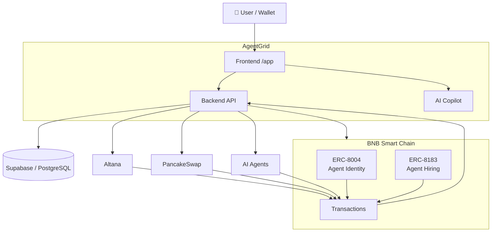

---

# 2. Core Architecture

```text
                         USER
                          │
                          ▼
                ┌──────────────────┐
                │    FRONTEND      │
                │      /app        │
                └────────┬─────────┘
                         │
                         ▼
                ┌──────────────────┐
                │    BACKEND API   │
                │                  │
                │ Auth             │
                │ Agents           │
                │ Search           │
                │ Hiring           │
                │ Transactions     │
                │ AI               │
                │ Integrations     │
                └───────┬──────────┘
                        │
            ┌───────────┼────────────┐
            │           │            │
            ▼           ▼            ▼
       SUPABASE     BNB CHAIN    PARTNERS
       PostgreSQL      │         ├─ Altana
                      │         ├─ PancakeSwap
                      │         └─ ERC-8183
                      │
                      ▼
                 ON-CHAIN STATE
```

---

# 3. Supabase vs BNB Chain

The most important architectural rule:

> **Supabase stores application data. BNB Chain stores/verifies on-chain state.**

| Data | Source of Truth |
|---|---|
| Wallet ownership | Wallet signature / BNB Chain |
| Agent identity | ERC-8004 / BNB Chain |
| Transactions | BNB Chain |
| Payments | BNB Chain |
| Permissions | Altana / BNB Chain |
| Session revocation | Altana / BNB Chain |
| Agent metadata | Supabase |
| Search index | Supabase |
| Categories | Supabase |
| Marketplace activity | Supabase + indexed chain data |
| User preferences | Supabase |
| Hire history | Supabase + transaction references |
| AI context | Backend + Supabase |

Supabase may **cache/index blockchain data**, but must never override authoritative on-chain state.

---

# 4. Communication Model

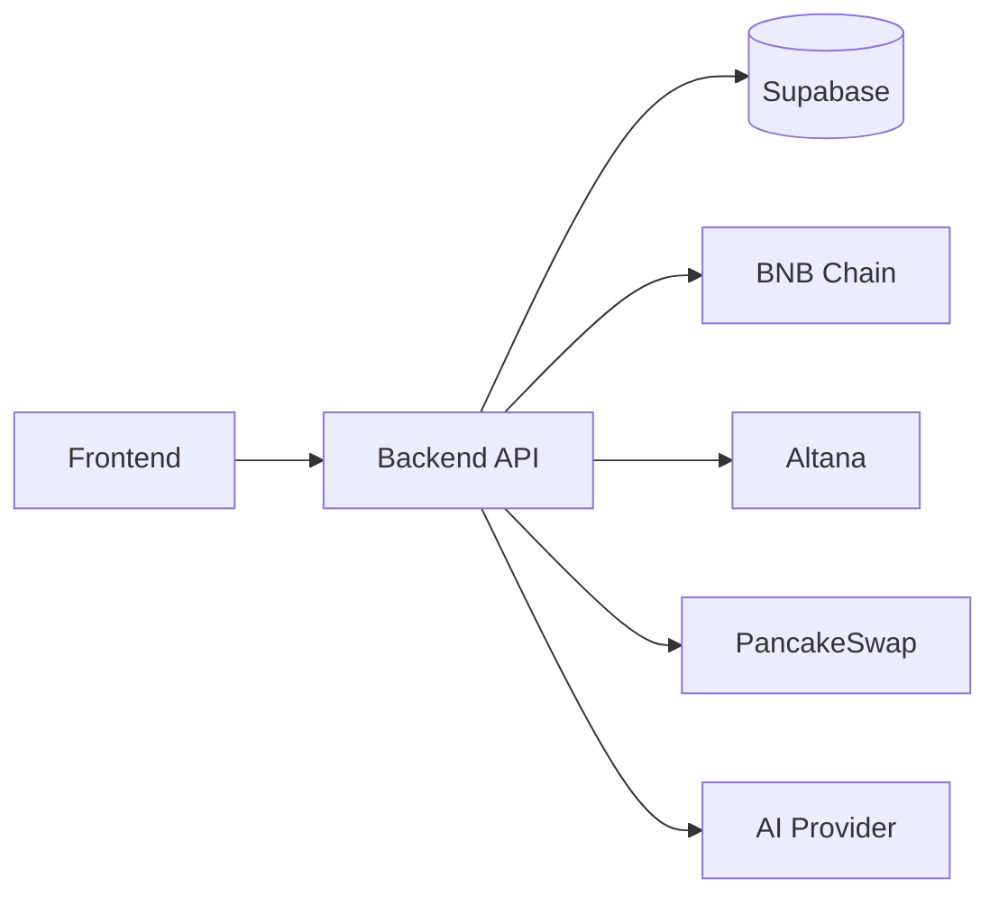

### Rule

```text
Frontend
   │
   ▼
Backend
   │
   ├── Supabase
   ├── BNB Chain
   ├── Altana
   ├── PancakeSwap
   └── AI Provider
```

The frontend should not contain:

- Private keys
- Service-role keys
- Partner secrets
- Sensitive business logic

---

# 5. Authentication

AgentGrid uses wallet-based authentication.

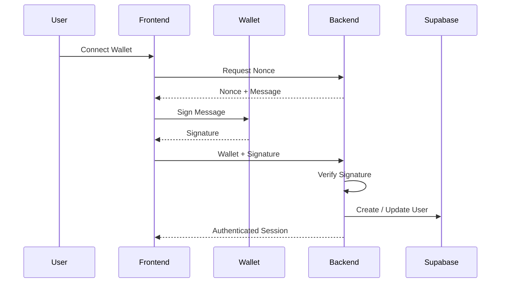

### Important

The wallet address alone is **not authentication**.

Authentication requires proof of wallet ownership through a signature.

---

# 6. ERC-8004 Agent Discovery

AgentGrid indexes agents registered on-chain.

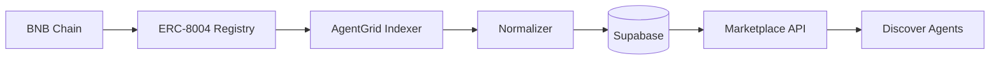

### Indexed information

```text
Agent ID
Owner
Metadata URI
Registration transaction
Block number
Timestamp
Capabilities
```

On-chain identity remains authoritative.

---

# 7. Agent Listing Flow

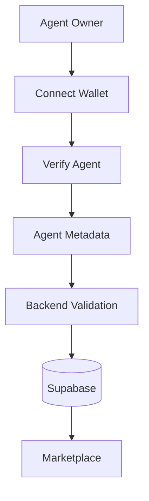

### Listing principle

```text
On-chain identity
        +
Marketplace metadata
        ↓
Public Agent Listing
```

Marketplace metadata must not be presented as blockchain-verified information.

---

# 8. Agent Discovery

```text
                    DISCOVER AGENTS
                           │
              ┌────────────┴────────────┐
              │                         │
           Search                    Filters
              │                         │
              │             ┌───────────┼───────────┐
              │             │           │           │
              │         Category     Protocol    Status
              │             │           │           │
              │         Trading     PancakeSwap  Trending
              │         Yield       Venus         New
              │         Research    Aave          Verified
              │         Security    Lista         Popular
              │
              └────────────┬────────────┘
                           ▼
                     Search Service
                           │
                           ▼
                       Supabase
                           │
                           ▼
                    Ranked Results
```

---

# 9. Marketplace Categories

Categories are discovery filters, not necessarily sidebar navigation items.

```text
Monitoring
Trading
Yield
Research
Security
DeFi
Portfolio
Automation
```

Protocol filters can include:

```text
PancakeSwap
Venus
Aave
Lista
Other BNB protocols
```

Marketplace filters can include:

```text
Trending
Newly Listed
Most Hired
Highest Rated
Highest Success Rate
Price
Verified
```

---

# 10. Marketplace Overview

The Overview page surfaces ecosystem activity.

```text
                 MARKETPLACE OVERVIEW
                          │
        ┌─────────────────┼─────────────────┐
        ▼                 ▼                 ▼
    Agent Stats       Recent Activity     Trends
        │                 │                 │
        ▼                 ▼                 ▼
   Active Agents      New Listings       Categories
   New Agents        Recent Hires       Protocols
   Total Hires       Transactions       Agents
```

Supported time windows:

```text
15m
30m
1h
24h
7d
```

---

# 11. Trending

Trending should be calculated from recent activity.

```text
Trending Score
      │
      ├── Recent Hires
      ├── Successful Tasks
      ├── Views
      ├── Recent Activity
      └── Transaction Activity
```

The scoring formula should be implemented in the backend and kept configurable.

---

# 12. Agent Hiring Flow

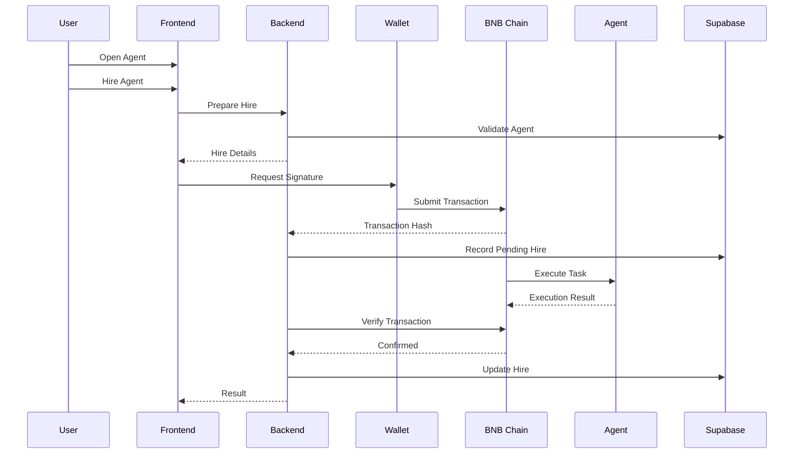

---

# 13. Transaction State

```text
CREATED
   │
   ▼
AWAITING_SIGNATURE
   │
   ▼
SUBMITTED
   │
   ▼
PENDING
   │
   ▼
CONFIRMED
```

Failure states:

```text
REJECTED
FAILED
EXPIRED
CANCELLED
```

A transaction hash does **not** mean the transaction succeeded.

---

# 14. Altana Architecture

Altana provides scoped autonomy for agents.

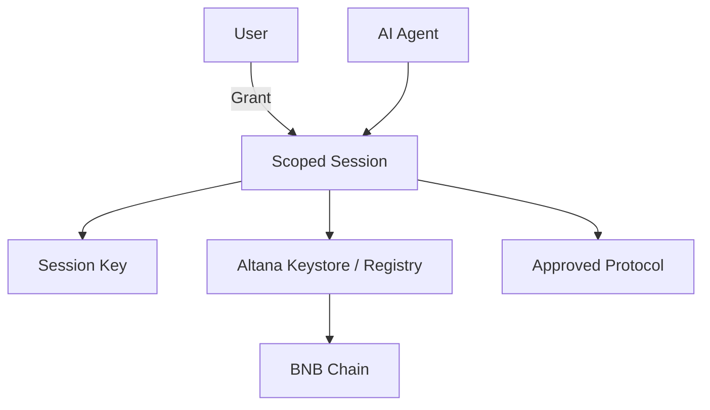

---

# 15. Altana Permissions

A session can define:

```text
Agent
   │
   ├── Allowed contracts
   ├── Allowed functions
   ├── Spend cap
   ├── Expiry
   └── Session key
```

Example:

```text
Agent: Yield Agent

Contract:
PancakeSwap

Allowed:
swap()

Spend Cap:
$100

Expiry:
24 hours
```

The user must see these permissions before granting them.

---

# 16. Altana Session Flow

```mermaid
sequenceDiagram

    participant U as User
    participant F as Frontend
    participant API as AgentGrid
    participant ALT as Altana
    participant W as Wallet
    participant BNB as BNB Chain

    U->>F: Configure Permissions
    F->>API: Validate Request
    API->>ALT: Prepare Session
    ALT-->>F: Transaction Data
    F->>W: Request Signature
    W->>BNB: Register Session
    BNB-->>ALT: Session Registered
    BNB-->>API: Confirmation
    API->>API: Index Session
```

---

# 17. Revocation

```text
USER
  │
  ▼
Agent Permissions
  │
  ▼
REVOKE
  │
  ▼
Wallet Signature
  │
  ▼
Altana
  │
  ▼
BNB Chain
  │
  ▼
Session Revoked
```

Supabase must never be used to fake a revocation.

---

# 18. PancakeSwap

PancakeSwap is a **protocol filter/integration**, not necessarily a primary sidebar section.

```text
Discover Agents
      │
      ▼
Filters
      │
      ├── Categories
      │
      ├── Protocols
      │      └── PancakeSwap
      │
      └── Marketplace
             Filters
```

Potential PancakeSwap agent use cases:

```text
Liquidity Management
Yield Discovery
Market Research
Safe Automated Swaps
```

---

# 19. PancakeSwap + Altana

```mermaid
sequenceDiagram

    participant U as User
    participant G as AgentGrid
    participant A as Agent
    participant ALT as Altana
    participant P as PancakeSwap
    participant B as BNB Chain

    U->>G: Hire Agent
    G->>U: Show Required Permissions
    U->>ALT: Grant Scoped Session
    ALT->>B: Register Session

    A->>ALT: Request Action
    ALT->>A: Allow if Within Scope
    A->>P: Execute Swap / DeFi Action
    P->>B: On-chain Transaction

    B-->>G: Transaction Event
    G-->>U: Result
```

---

# 20. AI Copilot

The AI Copilot can be opened globally as a right-side panel.

```text
┌──────────────────────────────────────────────────────────────┐
│ AgentGrid                  Search...       Wallet             │
├───────────────────────────────┬──────────────────────────────┤
│                               │                              │
│       Marketplace             │         ASK AI               │
│                               │                              │
│       Agent content           │  "What agent should I use    │
│                               │   for yield optimization?"    │
│                               │                              │
│                               │  AI Response                 │
│                               │                              │
└───────────────────────────────┴──────────────────────────────┘
```

---

# 21. AI Context

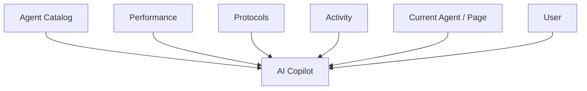

On an agent page:

```text
Ask questions about + [Agent Name]
```

The AI receives the current agent's structured data and capabilities.

---

# 22. AI Safety Boundary

```text
AI CAN
 ├── Search
 ├── Compare
 ├── Explain
 ├── Recommend
 ├── Analyze
 └── Prepare a transaction

AI CANNOT
 ├── Silently sign
 ├── Move funds
 ├── Grant permissions
 ├── Revoke permissions
 └── Execute financial actions
```

User approval is required for wallet actions.

---

# 23. Backend Services

```text
backend/
│
├── auth
├── agents
├── search
├── marketplace
├── hiring
├── transactions
├── activity
├── performance
├── reputation
├── ai
├── permissions
└── integrations
       ├── erc8004
       ├── erc8183
       ├── altana
       ├── pancakeswap
       └── x402
```

---

# 24. Backend Communication

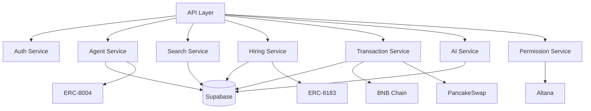

---

# 25. Adapter Pattern

External integrations should be isolated behind adapters.

```text
                SERVICE
                   │
                   ▼
              ADAPTER
                   │
        ┌──────────┼──────────┐
        ▼          ▼          ▼
      Altana   PancakeSwap  ERC-8183
```

This prevents partner-specific code from spreading throughout the application.

---

# 26. Database Overview

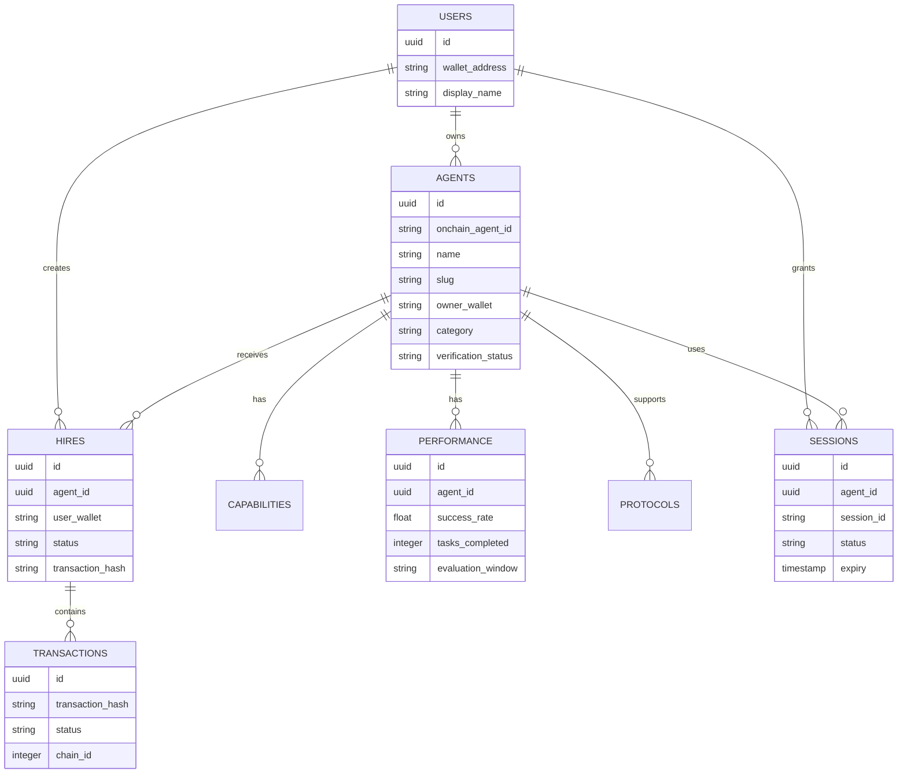

---

# 27. Blockchain Indexing

```mermaid
flowchart LR

    BNB["BNB Chain"]
       │
       ▼
    EVENTS["Events"]
       │
       ▼
    INDEXER["Indexer"]
       │
       ▼
    PARSER["Parser"]
       │
       ▼
    NORMALIZER["Normalizer"]
       │
       ▼
    DB[("Supabase")]
       │
       ▼
    MARKET["Marketplace"]
```

Indexing must be:

```text
Idempotent
Restart-safe
Deduplicated
Chain-aware
```

---

# 28. Agent Performance

```text
Agent
  │
  ├── Tasks Completed
  ├── Success Rate
  ├── Execution Time
  ├── Cost
  ├── User Ratings
  └── On-chain Activity
          │
          ▼
      Reputation
```

Performance claims should always have an evaluation window.

Example:

```text
Success Rate
94.2%

Tasks
1,243

Evaluation
Last 90 days
```

---

# 29. TermiX — Agent Advantage

No direct TermiX integration is required.

AgentGrid provides the evidence.

```text
              AGENT ADVANTAGE
                     │
          ┌──────────┼──────────┐
          ▼          ▼          ▼
        Time       Cost      Quality
          │          │          │
          └──────────┼──────────┘
                     ▼
              Manual vs Agent
```

Benchmark dataset:

```text
Task
Agent
Manual Time
Agent Time
Manual Cost
Agent Cost
Manual Output
Agent Output
Quality
Evaluation Notes
```

At least three real benchmark tasks should be recorded.

---

# 30. Agent-to-Agent Commerce

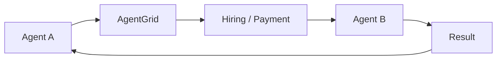

Potential infrastructure:

```text
ERC-8183
x402 / B402
Altana
BNB Chain
```

---

# 31. Security Boundary

```text
┌─────────────────────────────────────┐
│             FRONTEND                │
│                                     │
│ UI / Wallet / User Interaction      │
└──────────────────┬──────────────────┘
                   │
                   ▼
┌─────────────────────────────────────┐
│              BACKEND                │
│                                     │
│ Validation / Authorization / Logic  │
└───────────────┬───────────┬─────────┘
                │           │
                ▼           ▼
          ┌──────────┐  ┌────────────┐
          │ Supabase │  │ BNB Chain  │
          └──────────┘  └────────────┘
```

Never expose:

```text
Private Keys
Service Role Keys
Partner Secrets
AI Provider Secrets
RPC Credentials
```

---

# 32. Data Ownership Rule

```text
┌───────────────────────┬──────────────────────────┐
│       SUPABASE        │       BNB / ALTANA       │
├───────────────────────┼──────────────────────────┤
│ Search                │ Wallet ownership         │
│ Profiles              │ Agent identity           │
│ Categories            │ Transactions             │
│ Marketplace metadata  │ Payments                 │
│ User preferences      │ Permissions              │
│ Activity index        │ Session revocation       │
│ Performance index     │ Smart contract state     │
└───────────────────────┴──────────────────────────┘
```

---

# 33. Repository Structure

```text
/
├── app/                    # Frontend
│
├── backend/                # Backend/API
│   ├── auth/
│   ├── agents/
│   ├── search/
│   ├── hiring/
│   ├── transactions/
│   ├── ai/
│   └── integrations/
│
├── lib/                    # Shared infrastructure
│   ├── blockchain/
│   ├── supabase/
│   ├── erc8004/
│   ├── erc8183/
│   ├── altana/
│   ├── pancakeswap/
│   └── payments/
│
├── database/
│   ├── migrations/
│   └── seeds/
│
├── scripts/
│   └── indexing/
│
├── tests/
│
├── README.md
├── architecture.md
└── .env.example
```

The exact folder structure may evolve with the chosen framework, but the architectural boundaries should remain intact.

---

# 34. Hackathon Architecture

The initial implementation should remain simple.

```text
                 HACKATHON MVP

              ┌──────────────┐
              │   Frontend   │
              └──────┬───────┘
                     │
              ┌──────▼───────┐
              │ Backend API  │
              └──┬───────┬───┘
                 │       │
          ┌──────▼───┐ ┌─▼──────────┐
          │ Supabase │ │ BNB Chain  │
          └──────────┘ └─────┬──────┘
                              │
                    ┌─────────┼─────────┐
                    ▼         ▼         ▼
                  Altana   PancakeSwap ERC-8004
```

Avoid unnecessary microservices.

---

# 35. Long-Term Evolution

```text
PHASE 1
Monolithic Backend
+
Supabase
+
BNB Chain
+
Partner Adapters

              ↓

PHASE 2
Dedicated Indexer
+
Background Workers
+
Caching
+
Search Optimization

              ↓

PHASE 3
Execution Workers
+
Dedicated Search
+
Scalable Agent Infrastructure
```

---

# 36. Architecture Rules

### Rule 01

**Blockchain is authoritative for on-chain state.**

### Rule 02

**Supabase is the application database, not a blockchain replacement.**

### Rule 03

**Users control their wallets.**

### Rule 04

**AI cannot silently perform financial actions.**

### Rule 05

**Agents receive minimum necessary permissions.**

### Rule 06

**Partner integrations use adapters.**

### Rule 07

**Every blockchain transaction must be verified.**

### Rule 08

**Marketplace claims should be backed by data.**

### Rule 09

**The frontend communicates with the backend through defined APIs.**

### Rule 10

**Keep the hackathon architecture simple enough for a two-person team.**

---

# 37. The Mental Model

If either developer forgets how something works, use this:

```text
                    AGENTGRID
                       │
       ┌───────────────┼────────────────┐
       │               │                │
       ▼               ▼                ▼
   DISCOVERY        COMMERCE        AUTONOMY
       │               │                │
       ▼               ▼                ▼
 Supabase          BNB Chain         Altana
       │               │                │
       └───────────────┼────────────────┘
                       ▼
                  AI AGENTS
                       │
                       ▼
                 BNB ECOSYSTEM
```

Or, even simpler:

```text
SUPABASE
"What does the marketplace know?"

        +

BNB CHAIN
"What actually happened?"

        +

ALTANA
"What is this agent allowed to do?"

        +

AI
"How does the user interact with all of this?"

        +

AGENTS
"What actually performs the work?"
```

> **AgentGrid = Discovery + Trust + Hiring + Autonomous Execution.**